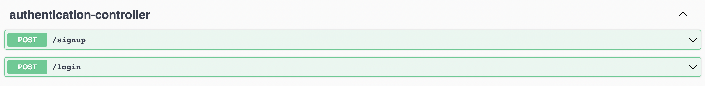
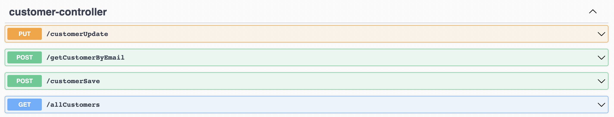
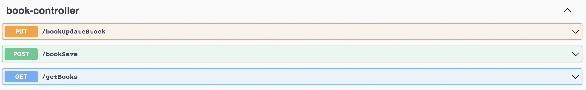
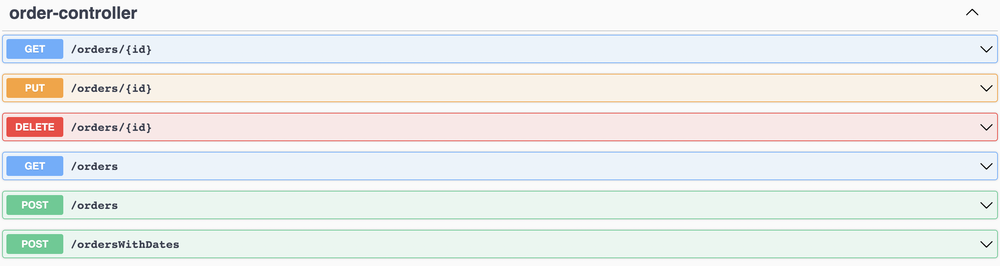
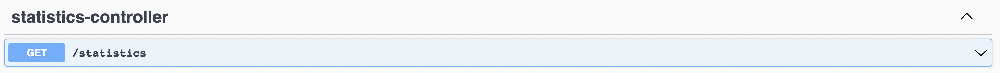
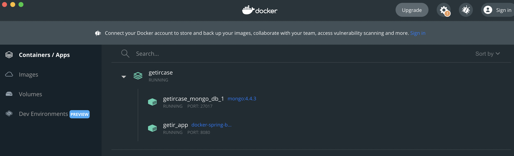

# Reading is Good

**Project Url**: https://github.com/tahabaskak/reading-good.git

## Rest API ( Reading is Good )

### Controllers and Endpoints
- Authentication Controller
  - Sign Up
  - Login

- Customer Controller
  - Create Customer
  - Update Customer
  - List Customers
  - Get Customer By Id

- Book Controller

  - Create Book
  - Update Book Stock
  - List Book
  - 

- Order Controller

  - Create Order
  - Cancel Order
  - Delete Order
  - Get Order By Id
  - Get Orders With Date
  - List Orders

- Statistics Controller
  - Orders Statistics

Note:
- **Swagger-UI URL** : http://localhost:8080/swagger-ui/index.html

## How to run

- cd {project-folder}
- mvn clean install
- docker compose up -d

## Languages and Tools
- Java 11
- Spring Boot
- Maven
- MongoDb
- Docker
- Swagger
- Postman

## Personenel Info

- **Developer**: Taha Başkak
- **LinkedIn** : https://www.linkedin.com/in/tahabaskak/
- **Github** : https://github.com/tahabaskak

